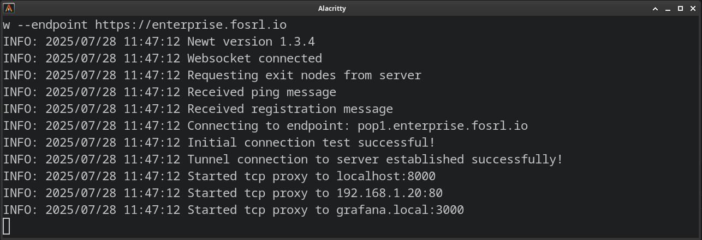

# Newt

Newt is a fully user space [WireGuard](https://www.wireguard.com/) tunnel client and TCP/UDP proxy, designed to securely expose private resources controlled by Pangolin. By using Newt, you don't need to manage complex WireGuard tunnels and NATing.

### Installation and Documentation

Newt is used with Pangolin and Gerbil as part of the larger system. See documentation below:

-   [Full Documentation](https://docs.fossorial.io)

## Preview



_Sample output of a Newt connected to Pangolin and hosting various resource target proxies._

## Key Functions

### Registers with Pangolin

Using the Newt ID and a secret, the client will make HTTP requests to Pangolin to receive a session token. Using that token, it will connect to a websocket and maintain that connection. Control messages will be sent over the websocket.

### Receives WireGuard Control Messages

When Newt receives WireGuard control messages, it will use the information encoded (endpoint, public key) to bring up a WireGuard tunnel using [netstack](https://github.com/WireGuard/wireguard-go/blob/master/tun/netstack/examples/http_server.go) fully in user space. It will ping over the tunnel to ensure the peer on the Gerbil side is brought up.

### Receives Proxy Control Messages

When Newt receives WireGuard control messages, it will use the information encoded to create a local low level TCP and UDP proxies attached to the virtual tunnel in order to relay traffic to programmed targets.

## CLI Args

-   `id`: Newt ID generated by Pangolin to identify the client.
-   `secret`: A unique secret (not shared and kept private) used to authenticate the client ID with the websocket in order to receive commands.
-   `endpoint`: The endpoint where both Gerbil and Pangolin reside in order to connect to the websocket.

-   `mtu` (optional): MTU for the internal WG interface. Default: 1280
-   `dns` (optional): DNS server to use to resolve the endpoint. Default: 9.9.9.9
-   `log-level` (optional): The log level to use (DEBUG, INFO, WARN, ERROR, FATAL). Default: INFO
-   `enforce-hc-cert` (optional): Enforce certificate validation for health checks. Default: false (accepts any cert)
-   `docker-socket` (optional): Set the Docker socket to use the container discovery integration
-   `ping-interval` (optional): Interval for pinging the server. Default: 3s
-   `ping-timeout` (optional): Timeout for each ping. Default: 5s
-   `updown` (optional): A script to be called when targets are added or removed.
-   `tls-client-cert` (optional): Client certificate (p12 or pfx) for mTLS. See [mTLS](#mtls)
-   `tls-client-cert` (optional): Path to client certificate (PEM format, optional if using PKCS12). See [mTLS](#mtls)
-   `tls-client-key` (optional): Path to private key for mTLS (PEM format, optional if using PKCS12)
-   `tls-ca-cert` (optional): Path to CA certificate to verify server (PEM format, optional if using PKCS12)
-   `docker-enforce-network-validation` (optional): Validate the container target is on the same network as the newt process. Default: false
-   `health-file` (optional): Check if connection to WG server (pangolin) is ok. creates a file if ok, removes it if not ok. Can be used with docker healtcheck to restart newt
-   `accept-clients` (optional): Enable WireGuard server mode to accept incoming newt client connections. Default: false
    -   `generateAndSaveKeyTo` (optional): Path to save generated private key
    -   `native` (optional): Use native WireGuard interface when accepting clients (requires WireGuard kernel module and Linux, must run as root). Default: false (uses userspace netstack)
        -   `interface` (optional): Name of the WireGuard interface. Default: newt
        -   `keep-interface` (optional): Keep the WireGuard interface. Default: false

## Environment Variables

All CLI arguments can be set using environment variables as an alternative to command line flags. Environment variables are particularly useful when running Newt in containerized environments.

-   `PANGOLIN_ENDPOINT`: Endpoint of your pangolin server (equivalent to `--endpoint`)
-   `NEWT_ID`: Newt ID generated by Pangolin (equivalent to `--id`)
-   `NEWT_SECRET`: Newt secret for authentication (equivalent to `--secret`)
-   `MTU`: MTU for the internal WG interface. Default: 1280 (equivalent to `--mtu`)
-   `DNS`: DNS server to use to resolve the endpoint. Default: 9.9.9.9 (equivalent to `--dns`)
-   `LOG_LEVEL`: Log level (DEBUG, INFO, WARN, ERROR, FATAL). Default: INFO (equivalent to `--log-level`)
-   `DOCKER_SOCKET`: Path to Docker socket for container discovery (equivalent to `--docker-socket`)
-   `PING_INTERVAL`: Interval for pinging the server. Default: 3s (equivalent to `--ping-interval`)
-   `PING_TIMEOUT`: Timeout for each ping. Default: 5s (equivalent to `--ping-timeout`)
-   `UPDOWN_SCRIPT`: Path to updown script for target add/remove events (equivalent to `--updown`)
-   `TLS_CLIENT_CERT`: Path to client certificate for mTLS (equivalent to `--tls-client-cert`)
-   `TLS_CLIENT_CERT`: Path to client certificate for mTLS (equivalent to `--tls-client-cert`)
-   `TLS_CLIENT_KEY`: Path to private key for mTLS (equivalent to `--tls-client-key`)
-   `TLS_CA_CERT`: Path to CA certificate to verify server (equivalent to `--tls-ca-cert`)
-   `DOCKER_ENFORCE_NETWORK_VALIDATION`: Validate container targets are on same network. Default: false (equivalent to `--docker-enforce-network-validation`)
-   `ENFORCE_HC_CERT`: Enforce certificate validation for health checks. Default: false (equivalent to `--enforce-hc-cert`)
-   `HEALTH_FILE`: Path to health file for connection monitoring (equivalent to `--health-file`)
-   `ACCEPT_CLIENTS`: Enable WireGuard server mode. Default: false (equivalent to `--accept-clients`)
-   `GENERATE_AND_SAVE_KEY_TO`: Path to save generated private key (equivalent to `--generateAndSaveKeyTo`)
-   `USE_NATIVE_INTERFACE`: Use native WireGuard interface (Linux only). Default: false (equivalent to `--native`)
-   `INTERFACE`: Name of the WireGuard interface. Default: newt (equivalent to `--interface`)
-   `KEEP_INTERFACE`: Keep the WireGuard interface after shutdown. Default: false (equivalent to `--keep-interface`)
-   `CONFIG_FILE`: Load the config json from this file instead of in the home folder.

## Loading secrets from files

You can use `CONFIG_FILE` to define a location of a config file to store the credentials between runs. 

```
$ cat ~/.config/newt-client/config.json
{
  "id": "spmzu8rbpzj1qq6",
  "secret": "f6v61mjutwme2kkydbw3fjo227zl60a2tsf5psw9r25hgae3",
  "endpoint": "https://pangolin.fossorial.io",
  "tlsClientCert": ""
}
```

This file is also written to when newt first starts up. So you do not need to run every time with --id and secret if you have run it once! 

Default locations: 

- **macOS**: `~/Library/Application Support/newt-client/config.json`
- **Windows**: `%PROGRAMDATA%\newt\newt-client\config.json`
- **Linux/Others**: `~/.config/newt-client/config.json`

## Examples

**Note**: When both environment variables and CLI arguments are provided, CLI arguments take precedence.

-   Example:

```bash
newt \
--id 31frd0uzbjvp721 \
--secret h51mmlknrvrwv8s4r1i210azhumt6isgbpyavxodibx1k2d6 \
--endpoint https://example.com
```

You can also run it with Docker compose. For example, a service in your `docker-compose.yml` might look like this using environment vars (recommended):

```yaml
services:
    newt:
        image: fosrl/newt
        container_name: newt
        restart: unless-stopped
        environment:
            - PANGOLIN_ENDPOINT=https://example.com
            - NEWT_ID=2ix2t8xk22ubpfy
            - NEWT_SECRET=nnisrfsdfc7prqsp9ewo1dvtvci50j5uiqotez00dgap0ii2
            - HEALTH_FILE=/tmp/healthy
```

You can also pass the CLI args to the container:

```yaml
services:
    newt:
        image: fosrl/newt
        container_name: newt
        restart: unless-stopped
        command:
            - --id 31frd0uzbjvp721
            - --secret h51mmlknrvrwv8s4r1i210azhumt6isgbpyavxodibx1k2d6
            - --endpoint https://example.com
            - --health-file /tmp/healthy
```

## Accept Client Connections

When the `--accept-clients` flag is enabled (or `ACCEPT_CLIENTS=true` environment variable is set), Newt operates as a WireGuard server that can accept incoming client connections from other devices. This enables peer-to-peer connectivity through the Newt instance.

### How It Works

In client acceptance mode, Newt:

-   **Creates a WireGuard service** that can accept incoming connections from other WireGuard clients
-   **Starts a connection testing server** (WGTester) that responds to connectivity checks from remote clients
-   **Manages peer configurations** dynamically based on Pangolin's instructions
-   **Enables bidirectional communication** between the Newt instance and connected clients

### Use Cases

-   **Site-to-site connectivity**: Connect multiple locations through a central Newt instance
-   **Client access to private networks**: Allow remote clients to access resources behind the Newt instance
-   **Development environments**: Provide developers secure access to internal services

### Client Tunneling Modes

Newt supports two WireGuard tunneling modes:

#### Userspace Mode (Default)

By default, Newt uses a fully userspace WireGuard implementation using [netstack](https://github.com/WireGuard/wireguard-go/blob/master/tun/netstack/examples/http_server.go). This mode:

-   **Does not require root privileges**
-   **Works on all supported platforms** (Linux, Windows, macOS)
-   **Does not require WireGuard kernel module** to be installed
-   **Runs entirely in userspace** - no system network interface is created
-   **Is containerization-friendly** - works seamlessly in Docker containers

This is the recommended mode for most deployments, especially containerized environments.

In this mode, TCP and UDP is proxied out of newt from the remote client using TCP/UDP resources in Pangolin.

#### Native Mode (Linux only)

When using the `--native` flag or setting `USE_NATIVE_INTERFACE=true`, Newt uses the native WireGuard kernel module. This mode:

-   **Requires root privileges** to create and manage network interfaces
-   **Only works on Linux** with the WireGuard kernel module installed
-   **Creates a real network interface** (e.g., `newt0`) on the system
-   **May offer better performance** for high-throughput scenarios
-   **Requires proper network permissions** and may conflict with existing network configurations

In this mode it functions like a traditional VPN interface - all data arrives on the interface and you must get it to the destination (or access things locally).

#### Native Mode Requirements

To use native mode:

1. Run on a Linux system
2. Install the WireGuard kernel module
3. Run Newt as root (`sudo`)
4. Ensure the system allows creation of network interfaces

Docker Compose example:

```yaml
services:
    newt:
        image: fosrl/newt
        container_name: newt
        restart: unless-stopped
        environment:
            - PANGOLIN_ENDPOINT=https://example.com
            - NEWT_ID=2ix2t8xk22ubpfy
            - NEWT_SECRET=nnisrfsdfc7prqsp9ewo1dvtvci50j5uiqotez00dgap0ii2
            - ACCEPT_CLIENTS=true
```

### Technical Details

When client acceptance is enabled:

-   **WGTester Server**: Runs on `port + 1` (e.g., if WireGuard uses port 51820, WGTester uses 51821)
-   **Connection Testing**: Responds to UDP packets with magic header `0xDEADBEEF` for connectivity verification
-   **Dynamic Configuration**: Peer configurations are managed remotely through Pangolin
-   **Proxy Integration**: Can work with both userspace (netstack) and native WireGuard modes

**Note**: Client acceptance mode requires coordination with Pangolin for peer management and configuration distribution.

### Docker Socket Integration

Newt can integrate with the Docker socket to provide remote inspection of Docker containers. This allows Pangolin to query and retrieve detailed information about containers running on the Newt client, including metadata, network configuration, port mappings, and more.

**Configuration:**

You can specify the Docker socket path using the `--docker-socket` CLI argument or by setting the `DOCKER_SOCKET` environment variable. If the Docker socket is not available or accessible, Newt will gracefully disable Docker integration and continue normal operation.

Supported values include:

-   Local UNIX socket (default):
    >You must mount the socket file into the container using a volume, so Newt can access it.

    `unix:///var/run/docker.sock`

-   TCP socket (e.g., via Docker Socket Proxy):

    `tcp://localhost:2375`

-   HTTP/HTTPS endpoints (e.g., remote Docker APIs):

    `http://your-host:2375`

-   SSH connections (experimental, requires SSH setup):

    `ssh://user@host`


```yaml
services:
    newt:
        image: fosrl/newt
        container_name: newt
        restart: unless-stopped
        volumes:
            - /var/run/docker.sock:/var/run/docker.sock:ro
        environment:
            - PANGOLIN_ENDPOINT=https://example.com
            - NEWT_ID=2ix2t8xk22ubpfy
            - NEWT_SECRET=nnisrfsdfc7prqsp9ewo1dvtvci50j5uiqotez00dgap0ii2
            - DOCKER_SOCKET=unix:///var/run/docker.sock
```
>If you previously used just a path like `/var/run/docker.sock`, it still works — Newt assumes it is a UNIX socket by default.

#### Hostnames vs IPs

When the Docker Socket Integration is used, depending on the network which Newt is run with, either the hostname (generally considered the container name) or the IP address of the container will be sent to Pangolin. Here are some of the scenarios where IPs or hostname of the container will be utilised:

-   **Running in Network Mode 'host'**: IP addresses will be used
-   **Running in Network Mode 'bridge'**: IP addresses will be used
-   **Running in docker-compose without a network specification**: Docker compose creates a network for the compose by default, hostnames will be used
-   **Running on docker-compose with defined network**: Hostnames will be used

### Docker Enforce Network Validation

When run as a Docker container, Newt can validate that the target being provided is on the same network as the Newt container and only return containers directly accessible by Newt. Validation will be carried out against either the hostname/IP Address and the Port number to ensure the running container is exposing the ports to Newt.

It is important to note that if the Newt container is run with a network mode of `host` that this feature will not work. Running in `host` mode causes the container to share its resources with the host machine, therefore making it so the specific host container information for Newt cannot be retrieved to be able to carry out network validation.

**Configuration:**

Validation is `false` by default. It can be enabled via setting the `--docker-enforce-network-validation` CLI argument or by setting the `DOCKER_ENFORCE_NETWORK_VALIDATION` environment variable.

If validation is enforced and the Docker socket is available, Newt will **not** add the target as it cannot be verified. A warning will be presented in the Newt logs.

### Updown

You can pass in a updown script for Newt to call when it is adding or removing a target:

`--updown "python3 test.py"`

It will get called with args when a target is added:
`python3 test.py add tcp localhost:8556`
`python3 test.py remove tcp localhost:8556`

Returning a string from the script in the format of a target (`ip:dst` so `10.0.0.1:8080`) it will override the target and use this value instead to proxy.

You can look at updown.py as a reference script to get started!

### mTLS

Newt supports mutual TLS (mTLS) authentication if the server is configured to request a client certificate. You can use either a PKCS12 (.p12/.pfx) file or split PEM files for the client cert, private key, and CA.

#### Option 1: PKCS12 (Legacy)

> This is the original method and still supported.

* File must contain:

  * Client private key
  * Public certificate
  * CA certificate
* Encrypted `.p12` files are **not supported**

Example:

```bash
newt \
--id 31frd0uzbjvp721 \
--secret h51mmlknrvrwv8s4r1i210azhumt6isgbpyavxodibx1k2d6 \
--endpoint https://example.com \
--tls-client-cert ./client.p12
```

#### Option 2: Split PEM Files (Preferred)

You can now provide separate files for:

* `--tls-client-cert`: client certificate (`.crt` or `.pem`)
* `--tls-client-key`: client private key (`.key` or `.pem`)
* `--tls-ca-cert`: CA cert to verify the server

Example:

```bash
newt \
--id 31frd0uzbjvp721 \
--secret h51mmlknrvrwv8s4r1i210azhumt6isgbpyavxodibx1k2d6 \
--endpoint https://example.com \
--tls-client-cert ./client.crt \
--tls-client-key ./client.key \
--tls-ca-cert ./ca.crt
```


```yaml
services:
    newt:
        image: fosrl/newt
        container_name: newt
        restart: unless-stopped
        environment:
            - PANGOLIN_ENDPOINT=https://example.com
            - NEWT_ID=2ix2t8xk22ubpfy
            - NEWT_SECRET=nnisrfsdfc7prqsp9ewo1dvtvci50j5uiqotez00dgap0ii2
            - TLS_CLIENT_CERT=./client.p12
```

## Build

### Container

Ensure Docker is installed.

```bash
make
```

### Binary

Make sure to have Go 1.23.1 installed.

```bash
make local
```

### Nix Flake

```bash
nix build
```

Binary will be at `./result/bin/newt`

Development shell available with `nix develop`

## Licensing

Newt is dual licensed under the AGPLv3 and the Fossorial Commercial license. For inquiries about commercial licensing, please contact us.

## Contributions

Please see [CONTRIBUTIONS](./CONTRIBUTING.md) in the repository for guidelines and best practices.
